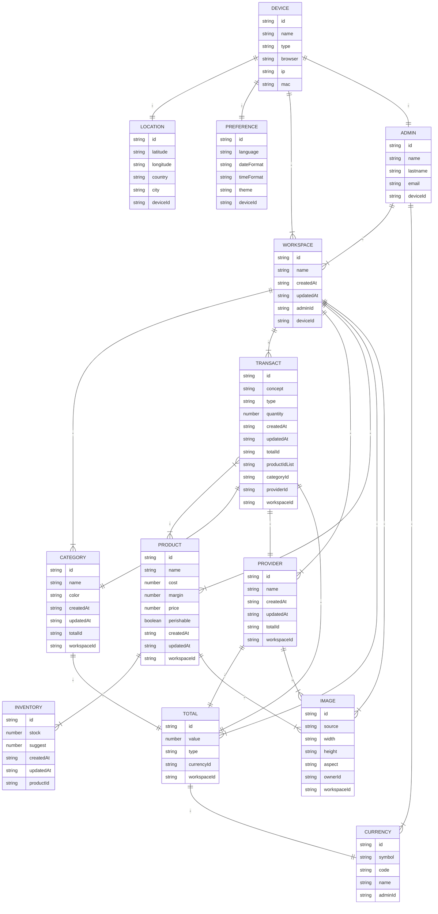

<!--
Created: Mon Apr 18 2022 10:28:44 GMT-0400 (hora de Bolivia)
Modified: Mon Apr 18 2022 18:33:38 GMT-0400 (hora de Bolivia)
-->

# Wall-E

Your pocket-sized smart financial assistant that controls your finances.

## NoSQL Database Diagram

